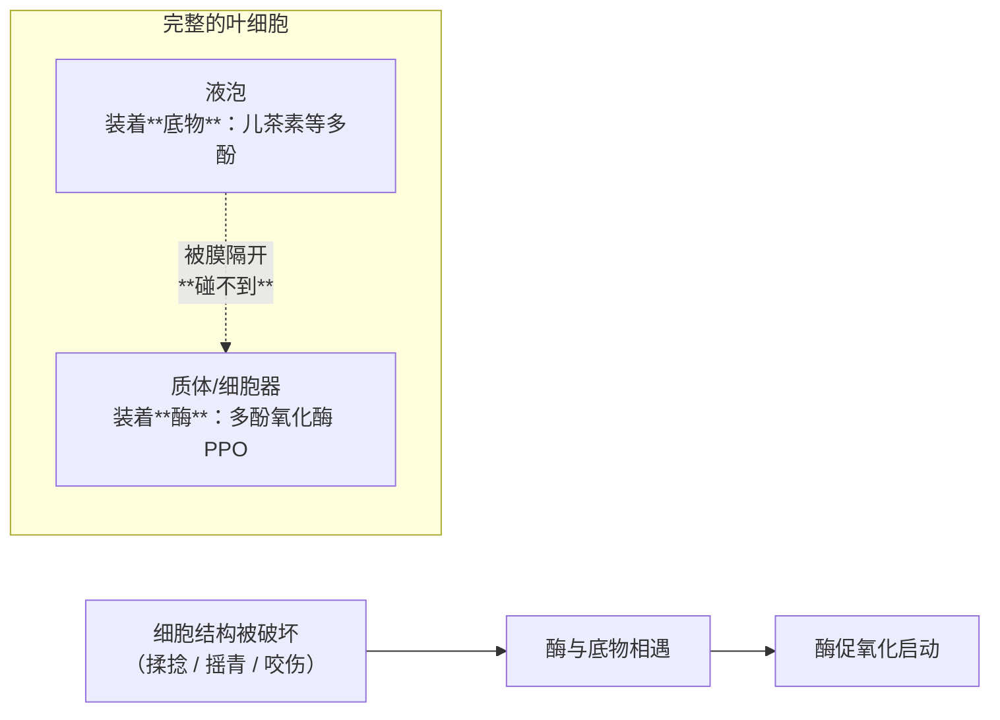
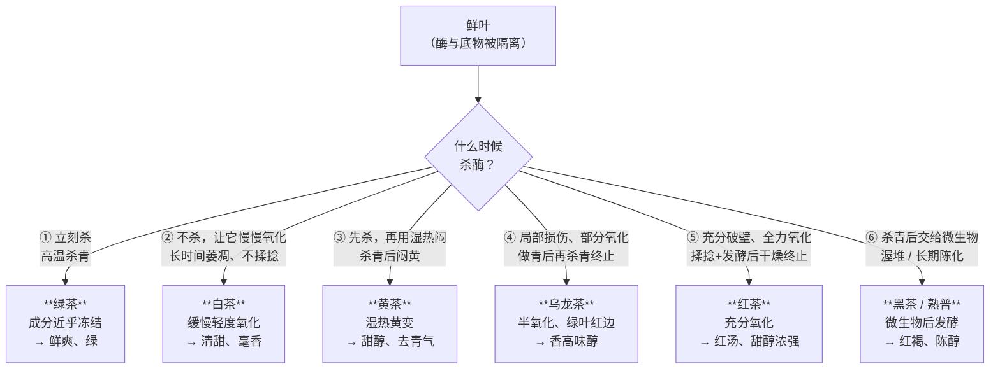
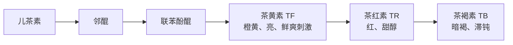

# 第 4 章 酶与氧化：所谓"发酵"到底发生了什么

> 本章目标：拆掉茶行业最大的一个历史误称，并建立第二部分的总纲。
>
> **一句话结论先给**：茶行业说的"发酵"，**除黑茶外都不是微生物发酵**，
> 而是茶叶自身的酶催化的**氧化**。而六大茶类的分野，本质上就是
> **对同一种酶做了四种不同的处理**。
>
> 这是第一部分的收口——学完这章，你可以直接进入第二部分看六大茶类的工艺了。

## 4.1 先纠正一个词

英文 fermentation、中文"发酵"，在茶行业沿用了一百多年。但严格说：

| 场景 | 实际机制 | 是"发酵"吗 |
|------|----------|-----------|
| 红茶"发酵" | 茶叶自身**多酚氧化酶催化的酶促氧化** | ❌ 不是 |
| 乌龙茶"半发酵" | 同上，只是程度较轻、且局部发生 | ❌ 不是 |
| 白茶"轻微发酵" | 萎凋过程中的**缓慢酶促氧化 + 湿热作用** | ❌ 不是 |
| 黄茶"闷黄" | **湿热作用为主**（是否含残余酶见 4.8 节） | ❌ 不是 |
| 黑茶 / 熟普"后发酵" | **微生物**参与，靠微生物的**胞外酶**转化 | ✅ **这个才是** |

> **为什么这个纠正重要**：因为"发酵"这个词会把你的直觉引向错误方向——
> 让你以为红茶像酸奶、面包一样是微生物做出来的，于是"红茶有益菌""发酵茶更养胃"
> 这类说法就有了想象空间。**红茶里没有发挥作用的微生物**，
> 它的转化在**茶叶细胞内部**就完成了。

本书之后统一用这三个词，请记住区别：

- **酶促氧化**：茶叶自身酶催化（绿、白、黄、青、红）；
- **湿热作用**：非酶的化学变化，靠温度 + 水分推动（闷黄、干燥、渥堆都有）；
- **微生物作用**：外来微生物及其胞外酶（黑茶、熟普）。

## 4.2 主角：多酚氧化酶，和一个"隔离"设计

**多酚氧化酶（PPO）**[^1]是这一切的核心。它催化的反应就是第 1 章那条路径的起点。

但茶树有一个很关键的**结构性设计**：



**底物和酶在活细胞里是被分开存放的。** 所以：

> **只要叶片完好，氧化就不会大规模发生。**
> 要让它发生，必须先**破坏细胞结构**——这就是揉捻和摇青真正在干的事。

这一条能解释很多现象：

- 鲜叶采下后放着会慢慢变红（细胞逐渐失水解体）；
- 摘一片新鲜茶叶捏碎，捏过的地方会先变褐；
- 乌龙茶的"**绿叶红边**"——摇青只损伤叶缘，所以只有叶缘氧化。

## 4.3 温度是总开关（本章最实用的一段）

酶是蛋白质，活性完全由温度控制。**关键温度节点**（指**叶温**，不是锅温）：

| 叶温 | 发生什么 |
|------|----------|
| **20~45 ℃** | 酶的**最适活动区间**。此区间内温度每升高 10 ℃，酶活性**增加一倍**（有资料给多酚氧化酶最适约 52 ℃，另有说 40~45 ℃ 最强） |
| **70 ℃** | 酶开始**钝化和变性**，活性被抑制 |
| **80~85 ℃** | 酶**凝固破坏**，活性基本被灭 |

> **⚠️ 这几个数值在不同资料间有小幅出入**（"最适 52 ℃" vs "40~45 ℃ 最强"），
> 但**结构是一致的**：低温区活性随温升快速增强 → 70 ℃ 开始失活 → 80~85 ℃ 基本终止。
> 本书用这个结构，不纠缠单点数值。

于是**杀青的工艺要求**就完全可以推导出来了：

> **必须在最短时间内把叶温提高到 70 ℃ 以上。**

- **温度太低**：叶子升温慢、在酶活跃区停留时间长 → 产生不正常红变 →
  **红叶红梗、闷红黄味**（这是绿茶的典型缺陷）；
- **温度过高**：叶绿素破坏过多 → 叶色泛黄，甚至**焦边、爆点**。

**杀青适度的判断**（很具体，值得记）：叶质柔软略带粘性，紧握成团稍有弹性，
嫩茎折而不断，老叶熟而不焦，表面失去光泽，略有清香，**鲜叶失重 30%~40%**，
达到"熟、透、匀"。下机后要**马上摊凉**（最好风扇吹凉），迅速降低叶温，
否则会继续黄变、产生**水闷味**。

### 一个精彩的推论：晒青为什么能做普洱

不同的干燥/杀青方式，叶温不同，**留给酶的活路也不同**：

| 类型 | 叶温 | 酶的结局 | 后果 |
|------|------|----------|------|
| **晒青**毛茶 | 多在 **80 ℃ 以下** | 多酚氧化酶**钝化较少，酶活性被部分保留** | 带青草气，**有利于普洱茶后期的转化** |
| **烘青 / 炒青**毛茶 | 多在 **90 ℃ 以上** | 多酚氧化酶**破坏彻底** | 低沸点香气物质消失，杀青叶透清香 |

> **这就是"为什么普洱生茶必须用晒青毛茶、不能用烘青"的机理答案。**
> 烘青把酶彻底杀死了，茶叶失去了自身的转化能力，后期陈化走不动。
> 用烘青压饼是市场上真实存在的问题（也是一种以次充好），第 31 章会讲怎么辨。
>
> **⚠️ 出处提示**：这条对照表我只找到行业资料的表述，未找到可直接引用的一手实验数据。
> 机理与 4.3 节的温度节点完全自洽，**方向可信**，但具体温度界线请以《制茶学》等教材为准。

## 4.4 六大茶类 = 对酶做四种处理

这是第二部分的**总纲**。把它记住，六大茶类就不用背了：



四种处理，用一句话说：

| 处理 | 茶类 | 关键词 |
|------|------|--------|
| **马上停** | 绿茶 | 杀青 |
| **让它慢慢来** | 白茶 | 萎凋 |
| **停了之后用湿热推** | 黄茶 | 闷黄 |
| **控制着让它走一段，再停** | 乌龙茶 | 做青（+ 焙火） |
| **让它走完** | 红茶 | 发酵 |
| **停了之后交给微生物** | 黑茶 | 渥堆 / 陈化 |

## 4.5 氧化到底生成了什么

第 1 章给过结果（茶黄素/茶红素/茶褐素），这里给**路径**：



**这条链是单向推进的**，于是"发酵程度"就有了物质含义：

| 氧化程度 | 主要停在哪 | 感官结果 |
|----------|-----------|----------|
| 不足 | 还有大量未氧化儿茶素 | 汤色欠红泛青、**味青涩**、叶底花青 |
| 适度 | TF / TR 比例协调 | 红艳明亮、甜醇浓强 |
| 过度 | 大量走到 TB | 汤色**红暗浑浊**、香气低闷、**滋味平淡**、叶底红暗多乌条 |

> **注意这条链解释了一件反直觉的事**：发酵过度不是"更浓"，而是"**更淡**"——
> 因为茶黄素这种带来鲜爽刺激的物质被进一步转化掉了，剩下滞钝的茶褐素。
> **"越发酵越浓"是错的。**

## 4.6 揉捻：让酶与底物相遇（但不是越狠越好）

揉捻有三个作用，第一个才是化学上的关键：

1. **破坏细胞结构** → 液泡里的多酚与酶相遇 → **为发酵创造前提**；
2. 做形（卷成紧细条）；
3. 揉出的茶汁凝聚在叶表 → 形成干茶色泽、冲泡时易溶出 → 增进茶汤浓度。

**关键洞察：细胞破损率不是越高越好。**

有一个很好的对照——**红碎茶**追求最大细胞破损率，结果是：

| | 红碎茶 | 传统工夫红茶 |
|---|---|---|
| 细胞破损率 | 极高 | 中等 |
| **茶黄素含量** | **最高** | 较低 |
| 滋味 | **浓强鲜爽** | 醇厚 |
| **香气与甜度** | **明显不如** | **更好** |

原因是：破损过于强烈、速度过快时，**其它酶类的活性明显降低** →
发酵中大分子物质的**水解反应减弱**（水解产生的可溶性糖、氨基酸是甜与香的来源）。

> **所以"浓强"和"香甜"是一对需要权衡的目标**，不是同一个方向上的程度差别。
> 这也解释了红碎茶为什么天生适合**加奶加糖**（浓强、需要被中和），
> 而工夫红茶适合清饮（香甜、层次好）。

## 4.7 红茶发酵的条件：把酶伺候到最舒服

既然是酶催化，那工艺就是在给酶创造最适环境。四个条件：

| 条件 | 参数 | 为什么 |
|------|------|--------|
| **温度** | 室温一般 **22~30 ℃**（生产上常 26~28 ℃，先高后低） | 30 ℃ 常被视为激活酶高活性的最佳温度；过低则氧化聚合走不完，过高会加速蛋白质与氧化多酚结合成**不溶性复合物** |
| **湿度** | 相对湿度 **95% 以上**（也有资料说 90% 以上，越高越好） | 高湿利于 PPO 活性、利于茶黄素形成积累；湿度过低会使**非酶促氧化加剧** → 汤色叶底变暗、滋味淡薄 |
| **时间** | 工夫红茶 **2~3 h**；红碎茶 **30~90 min** | 与叶子老嫩、整碎、揉捻程度、季节、温湿度都有关；夏秋茶需 2.0~4.5 h |
| **供氧** | 通风、适时翻拌，摊叶厚度按老嫩调整（嫩叶薄摊、老叶厚摊） | 氧化需要大量氧气；发酵叶中 **CO₂ 停滞积聚会抑制发酵** |

**一个有意思的工艺思路——变温发酵**：前期高温快速激活酶活性、促进多酚向茶黄素转化以降低苦涩，
后期低温稳定酶活性、利于茶黄素**持续积累**。一项研究中 **30 ℃ 1 h + 25 ℃ 2 h、RH 95%**
的变温发酵所得古树红茶在滋味、汤色、香气得分最高。

**发酵程度的把握原则："宁轻勿重"。** 为什么？

> 因为**发酵适度的叶子进入干燥后，叶温升高还会继续促进酶促氧化和湿热非酶促氧化**——
> 也就是说"停"这个动作本身有延迟。等你看到刚好，实际上已经过了。

**香气的变化顺序**（这是判断发酵进程的实用工具）：

```
青草气 → 清新花香 → 果香 → 甜香 → 香气下降 → 逐渐出现酸味
                              ↑ 到这里就该停
```

## 4.8 白茶萎凋、黄茶闷黄：另外两条路

### 白茶：不杀青、不揉捻，让酶慢慢工作

白茶的特殊性在于它**几乎没有"人为让酶与底物相遇"的步骤**——不揉捻。
所以它依赖的是**失水过程中细胞逐渐解体**带来的缓慢氧化。这就要求萎凋时间足够长。

一项针对'春雨 2 号'品种的对照研究给出了实测数据：

| 萎凋方式 | 时长 | 温湿度特点 |
|----------|------|-----------|
| **日光萎凋** | 约 **40 h** | 10~20 h 间因日光升温到 30~35 ℃，湿度降到 40% 左右 |
| **室内自然萎凋** | 约 **50 h** | 昼夜波动：白天升温降湿，夜间降温升湿 |
| **萎凋槽萎凋** | 约 **35 h** | 平均温度与室内接近，但平均湿度明显更低（68.7% vs 78.9%），所以更快 |

**最适条件**：温度 **20~30 ℃**、相对湿度 **60%~80%**。
温度与失水量正相关；温度提到 **36~42 ℃** 可把萎凋时间缩短到 **3~6 h**。

**失水速率会直接改变品质**：该研究的感官审评发现，室内萎凋成茶"尚绿带红叶、香气略带青气"，
而萎凋槽萎凋成茶"色绿较活、无青气"。推测原因是室内温度低、湿度大 → **失水慢** →
氧化进程减慢 → 色泽偏暗、萎凋不充分而显青气。

> **反直觉点**：**失水太慢反而做不好白茶**。
> 直觉上"慢工出细活"，但萎凋要的是**在合适的速率区间内失水**——
> 太快晒伤、太慢青气。这是第 7 章的核心难点。

**传统的失水判断节点**（室内自然萎凋，以"成数干"为标尺）：

| 节点 | 操作与判断 |
|------|-----------|
| 失水至**七成干** | 两筛并一筛；此时叶片不贴筛、毫色发白、叶色由浅绿转灰绿或深绿、叶缘略卷、芽尖与嫩梗呈"**翘尾**"、清气消失 |
| 失水至**八成干** | 再两筛并一筛，堆成 10~15 cm 厚的凹状继续萎凋 |
| 失水至**九成干** | 下筛，进入下一道工序 |

### 黄茶：闷黄——一处学界表述有分歧的地方

**共识部分**：闷黄的实质是在**温和的湿热条件**下，使茶多酚轻度氧化、多糖部分水解。
"黄变"只是表象，"**转味**"才是实质（去掉绿茶的青气、生涩，变得甜醇）。

**分歧部分（⚠️ 要诚实标注）**：

| 表述 | 立场 |
|------|------|
| "乌龙茶和红茶的发酵属酶促作用，而黄茶的闷黄是一种**湿热作用**" | 强调**非酶** |
| "闷黄与黄变的实质是利用在制茶叶中**残余酶**的活性，发生以儿茶素为主体的轻度**酶促**氧化、缩合反应，并伴随湿热化学作用" | 强调**有残余酶参与** |

> **本书的处理**：采用"**以湿热作用为主，可能伴有残余酶参与**"的表述。
> 理由是这两种说法并不真正矛盾——杀青后酶活性大幅下降但未必归零（回看 4.3 节：
> 70 ℃ 钝化、80~85 ℃ 才基本灭活，实际生产中残留多少取决于杀青程度），
> 所以"以湿热为主 + 残余酶可能有贡献"能同时容纳两种观察。
> **谁说"闷黄绝对不含酶促"，那是把一个仍有分歧的问题讲死了。**

**闷黄不是一道工序，而是一类手法**：具体有"堆闷""包黄""渥闷""堆黄""摊黄"等，
而且往往在**不同工序多次进行**，配合"炒/烘/焙"加热散水与"堆/摊/放"保温散热来调节。
按闷黄位置可把黄茶分三类：**杀青后闷黄、揉捻后闷黄、毛火后闷黄**。

> **一个很漂亮的类比**（来自科普资料，我认为很到位）：
> **闷黄与熟普的渥堆本质接近，都以绿茶为起点，只是走的路程远近不同**——
> 闷黄"浅尝即止"，渥堆"充分尽致"。

## 4.9 黑茶渥堆：唯一真正的"发酵"

这里的转化主体**不再是茶叶自身的酶**，而是**微生物及其胞外酶**。

**工艺概况**：晒青毛茶洒水、覆盖麻布堆积，茶堆高约 **1~2 m**，
**中心温度可达 40~60 ℃**（另有资料给 40~65 ℃）。

**优势菌是黑曲霉**：已鉴定出 71 株真菌，曲霉属繁殖最旺盛，尤其**黑曲霉是优势菌种**，
**大约占微生物总量的 80%**；其次是青霉、根霉、灰绿曲霉、酵母菌、乳酸菌等。
有文献给出的优势序列是：**黑曲霉 > 酵母菌 > 青霉 > 根霉 > 灰绿曲霉 > 细菌**。

**黑曲霉靠什么干活**：它能产生胞内、胞外两类酶，**约 20 种水解酶**，
其中葡萄糖淀粉酶、纤维素酶、果胶酶可分解多糖、脂肪、蛋白质、天然纤维、果胶和非可溶性化合物，
**水解产物多为单糖、氨基酸、水化果胶和可溶性碳水化合物** → 有效成分易于渗出扩散 →
这是熟普"**甘、滑、醇厚**"的物质基础。

**成分怎么变**：渥堆过程中茶多酚、儿茶素、TF、TR、氨基酸、可溶性糖含量**剧烈下降**，
**TB（茶褐素）和水不溶性茶多酚明显增加**。
所以熟普汤色红褐、几乎不涩——多酚已经被"吃掉"大半。

**主次关系有明确结论**：除了湿热作用，**微生物的参与起到了最为关键、不可替代的作用**。
而湿热作用则为微生物代谢创造环境、增强酶活性、提供热源——两者是**协同**的。

**不同黑茶的优势菌不一样**（这条很有用，说明"黑茶"内部差异极大）：

| 品类 | 优势菌 |
|------|--------|
| 茯砖、花砖、黑砖、青砖、沱茶、饼茶、紧茶 | **灰绿曲霉**占绝对优势 |
| 米砖 | **黑曲霉**占绝对优势 |
| 康砖、金尖、七子饼茶 | **青霉**占优势 |
| 六堡茶 | 青霉、灰绿曲霉及黑曲霉 |

> 这是 1979 年浙江农业大学茶叶系对 5 省区 14 种压制茶的霉菌研究结果。
> 年代较早，但它说明的道理没变：**"黑茶"是一个工艺类别，不是一种微生物过程。**

**一个食品安全相关的发现**：有研究指出黑曲霉在渥堆中后期稳占上风后，
**不仅抑制黄曲霉生长和产毒，还能在一定程度上降解黄曲霉毒素**。
（这不代表任何黑茶都安全——储存不当仍会霉变，见第 35 章。）

## 4.10 一张表收口第一部分

现在你可以把六大茶类的机制说清楚了：

| 茶类 | 主导机制 | 酶的处理 | 关键工序 | 结果方向 |
|------|----------|----------|----------|----------|
| 绿茶 | —（成分冻结） | **立即灭活**（叶温快速 >70 ℃） | 杀青 | 保留鲜叶格局，鲜爽 |
| 白茶 | 酶促氧化（缓慢）+ 湿热 | **不主动灭活**，靠失水自然衰减 | 萎凋（35~50 h） | 轻度氧化，清甜毫香 |
| 黄茶 | **湿热为主**（±残余酶） | 先灭活，留少量 | 杀青 + 闷黄 | 黄变、转味、甜醇 |
| 乌龙茶 | 酶促氧化（局部、部分） | **先放后收**：做青时活跃，杀青终止 | 做青（+ 焙火） | 半氧化、绿叶红边、香高 |
| 红茶 | 酶促氧化（充分） | 全程保持活跃，干燥终止 | 揉捻 + 发酵 | 充分氧化，红汤甜醇 |
| 黑茶 | **微生物作用** + 湿热 | 茶叶自身酶已非主角 | 渥堆 / 长期陈化 | 深度转化，红褐陈醇 |

> **第一部分到此结束。** 从这里进入第二部分，你会发现每一章都是在给这张表**填细节**：
> 具体温度、具体时长、具体判断标准、具体缺陷成因。**框架已经在你手里了。**

## 4.11 常见说法辨析

| 说法 | 判定 | 说明 |
|------|------|------|
| "红茶是发酵茶，所以含益生菌 / 更养胃" | **❌ 错误** | 红茶的"发酵"是自身酶促氧化，**没有起作用的微生物**，成品也不含活菌。养胃与否与"发酵"这个词无关 |
| "六大茶类都是发酵程度不同" | **⚠️ 半对** | 用来排序（绿<白<黄<青<红）作为教学简化可以；但机制上黄茶是湿热、黑茶是微生物，**不是同一根轴上的程度差** |
| "发酵越充分，茶越浓" | **❌ 错误** | 氧化链是 儿茶素→…→TF→TR→**TB**。过度发酵走到茶褐素，结果是汤色**红暗**、香气低闷、**滋味平淡**，不是更浓 |
| "揉捻越重、细胞破损率越高越好" | **❌ 错误** | 红碎茶破损率最高、茶黄素最高、浓强度最好，但**香气和甜度明显不如工夫红茶**（其它酶活性降低、水解反应减弱） |
| "普洱生茶用什么毛茶都行" | **❌ 错误** | 必须**晒青**。烘炒青叶温 >90 ℃ 把 PPO 彻底破坏，茶叶失去后期转化能力 |
| "闷黄就是纯粹的非酶湿热作用" | **⚠️ 有争议** | 学界表述不一：一说湿热作用，一说利用**残余酶**的轻度酶促氧化。本书采"以湿热为主、可能伴残余酶" |
| "黑茶的菌都是有益菌，越陈越健康" | **⚠️ 缺乏依据** | 渥堆优势菌因品类而异（灰绿曲霉/黑曲霉/青霉各不同）；黑曲霉抑制黄曲霉是有研究支持的，但这不等于"任何黑茶越陈越健康"。储存不当照样霉变 |
| "杀青就是把茶叶炒干" | **❌ 混淆工序** | 杀青的目的是**灭活酶**（快速使叶温 >70 ℃），失重只有 30%~40%，远未干燥；干燥是后面的工序 |

## 4.12 思考题

<a id="questions"></a>

1. 为什么说茶行业的"发酵"是个误称？六大茶类里**只有哪一类**算真正的发酵，为什么？
2. 茶树把多酚（底物）和多酚氧化酶（酶）分开存放。这个"隔离设计"能解释哪三个日常可观察到的现象？
3. 杀青为什么必须"**在最短时间内**把叶温提到 70 ℃ 以上"？如果升温太慢会出现什么缺陷、
   如果温度过高又会出现什么缺陷？
4. 普洱生茶为什么必须用晒青毛茶而不能用烘青？请用本章的温度节点回答。
5. "发酵越充分茶越浓"错在哪？请用氧化路径（儿茶素→…→TF→TR→TB）说明过度发酵为什么反而"淡"。
6. 红碎茶的茶黄素含量最高、浓强度最好，但香气和甜度不如工夫红茶。这说明了什么工艺权衡？
7. 白茶萎凋中"失水太慢反而做不好"，为什么？这与"慢工出细活"的直觉冲突在哪？
8. 红茶发酵为什么讲"宁轻勿重"？（提示：想想干燥这道工序对温度做了什么）
9. 闷黄到底含不含酶促作用？说明两种学界表述，并解释为什么它们**其实可以共存**。
10. （进阶）熟普渥堆中，茶多酚、氨基酸、可溶性糖都**剧烈下降**，
    但成品的口感却被描述为"甘滑醇厚"。这两件事矛盾吗？怎么解释？

> 📖 **参考答案**（想清楚再看）：[Q1](../../qa/04-enzymes-oxidation-qa.md#q1) ·
> [Q2](../../qa/04-enzymes-oxidation-qa.md#q2) · [Q3](../../qa/04-enzymes-oxidation-qa.md#q3) ·
> [Q4](../../qa/04-enzymes-oxidation-qa.md#q4) · [Q5](../../qa/04-enzymes-oxidation-qa.md#q5) ·
> [Q6](../../qa/04-enzymes-oxidation-qa.md#q6) · [Q7](../../qa/04-enzymes-oxidation-qa.md#q7) ·
> [Q8](../../qa/04-enzymes-oxidation-qa.md#q8) · [Q9](../../qa/04-enzymes-oxidation-qa.md#q9) ·
> [Q10](../../qa/04-enzymes-oxidation-qa.md#q10)

## 4.13 本章实操

<a id="practice"></a>

### 🅐 无器具版（强烈推荐）：一片叶子的氧化实验

**这个实验不需要买茶，只需要一片新鲜的植物叶子。** 找一片**新鲜采下的茶叶**最好；
没有茶树的话，用苹果、香蕉、土豆或牛油果代替也能看到同一个机制
（它们也含多酚和多酚氧化酶——切开后变褐就是酶促氧化）。

| 处理 | 操作 | 预测会发生什么 | 实际观察 |
|------|------|----------------|----------|
| A 对照 | 完整放置，不损伤 | | |
| B 破损 | 捏碎 / 切开，室温放置 | | |
| C **模拟杀青** | 切开后立刻用**沸水烫 30 秒**再放置 | | |
| D 低温 | 切开后立刻放冰箱 | | |

**填完"预测"再动手**，然后每 10 分钟看一次，记录 1 小时内的变化。

**预期结果与本章的对应**：

- **A 几乎不变** → 4.2 节：酶与底物被隔离，完整细胞不氧化；
- **B 明显褐变** → 揉捻/摇青在干什么；
- **C 基本不褐变** → **这就是杀青**（高温灭活酶）；
- **D 褐变明显变慢** → 4.3 节：酶活性随温度下降，"每降 10 ℃ 活性减半"的方向。

> **这是全书性价比最高的一个实验**：四个杯子，一小时，
> 你就把绿茶（C）、红茶（B）和低温储存（D）的原理全看了一遍。
> 而且它是**真正的对照实验**——一次只改一个变量。

### 🅐 无器具版加餐：给六大茶类填空

不看 4.10 那张表，凭理解填：

| 茶类 | 主导机制 | 酶怎么处理 | 关键工序 |
|------|----------|-----------|----------|
| 绿茶 | | | |
| 白茶 | | | |
| 黄茶 | | | |
| 乌龙茶 | | | |
| 红茶 | | | |
| 黑茶 | | | |

填完再对照。**这张表如果能默写出来，第二部分你会学得非常轻松。**

### 🅑 有条件版：同一片茶山、六种工艺的横向对比（备齐后再做）

**所需**：六大茶类各一款（不必名贵，能代表茶类特征即可）；盖碗；秤；[冲泡记录表](../../forms/brewing-log.md)。

这是第一部分的**收官实操**，目的是把四种"对酶的处理"喝出来：

| 茶类 | 预期汤色 | 预期涩感（0-5） | 预期甜/厚 | 叶底颜色 | 实际 |
|------|----------|----------------:|-----------|----------|------|
| 绿茶 | | | | | |
| 白茶 | | | | | |
| 黄茶 | | | | | |
| 乌龙茶 | | | | | |
| 红茶 | | | | | |
| 黑茶（熟普） | | | | | |

**重点观察两条轴**（先写预测，再喝）：

1. **汤色轴**：绿 → 黄 → 橙 → 红 → 红褐。这条轴就是氧化程度轴，也是 TF→TR→TB 的推进。
2. **涩感轴**：应该大致**递减**（绿茶/新白茶涩感最明显，熟普几乎不涩）——
   因为多酚被氧化/被微生物消耗掉了。

> **如果你的实测和预测不符**，先别怀疑理论，检查这三件事：
> ① 六个茶的**等级/嫩度**差异太大（第 3 章）；② 冲泡参数没统一；
> ③ 某个样本身有缺陷（发酵过度的红茶会"淡"而不是"浓"，见 4.5 节）。

## 4.14 本章主要参考

| 本章的哪个结论 | 来源 |
|----------------|------|
| 六大茶类关键工序统一框架（杀青/发酵/做青/渥堆/萎凋/闷黄） | [六大茶类加工关键工序及风味物质研究进展，《中国茶叶加工》2023（刘仲华、黄建安等）](https://www.sciopen.com/local/article_pdf/10.15905/j.zgcyjg.2095-0306.2023.04.01.pdf) |
| 酶的温度节点（20~45 ℃ 活跃 / 70 ℃ 钝化 / 80~85 ℃ 灭活）、杀青适度判断、失重 30%~40% | [绿茶杀青技术](https://baike.baidu.com/item/%E7%BB%BF%E8%8C%B6%E6%9D%80%E9%9D%92%E6%8A%80%E6%9C%AF/7573229)；[炒青](https://baike.baidu.com/item/%E7%82%92%E9%9D%92/917599)（与《制茶学》教材表述一致） |
| PPO 钝化动力学建模、红外杀青对 PPO 的影响 | [催化式红外杀青对绿茶热风干燥的影响，《食品科学》](https://www.spkx.net.cn/fileup/HTML/2017-38-9-020.shtml) |
| 晒青（<80 ℃，保留酶活）vs 烘炒青（>90 ℃，彻底破坏） | [普洱杂志：详解杀青、晒青、炒青](https://m.ipucha.com/show-35-1928.html)（⚠️ 行业资料，未找到一手实验数据，机理与温度节点自洽） |
| 揉捻的作用、氧化路径 儿茶素→邻醌→联苯酚醌→TF→TR→TB | [红茶加工篇·发酵](https://zhuanlan.zhihu.com/p/59329474)；[红茶的加工工艺及其品质特征](https://www.zsxztea.com/tea_1141.html) |
| 细胞破损率过高导致其它酶活性降低、水解减弱（红碎茶 vs 工夫红茶） | [红茶工艺探究——关键问题分析](https://blog.sina.com.cn/s/blog_98334afc0101ert0.html)（⚠️ 单一来源，作为"存在此论述"引用） |
| 红茶发酵温湿度时间、变温发酵（30 ℃ 1 h + 25 ℃ 2 h、RH 95%） | [不同发酵方式对古茶树鲜叶制备工夫红茶品质的影响，《中国酿造》](https://manu61.magtech.com.cn/zgnz/fileup/0254-5071/HTML/%E4%B8%AD%E5%9B%BD%E9%85%BF%E9%80%A0202310020.html) |
| "宁轻勿重"、香气变化顺序、发酵程度判断 | [正山小种红茶加工的几个关键技术探讨](https://www.zsxztea.com/tea_261.html)；[红茶的发酵工艺流程](https://www.zsxztea.com/tea_1150.html) |
| 白茶三种萎凋方式的时长与温湿度、最适 20~30 ℃/RH 60%~80%、36~42 ℃ 缩短至 3~6 h | [浙江"春雨2号"品种白茶加工工艺初探，《浙江大学学报（农业与生命科学版）》](https://html.rhhz.net/ZJDXXBNYYSMKXB/html/10468.htm) |
| 白茶并筛节点（七成/八成/九成干）、"翘尾" | [白茶常见的几种萎凋方式简述](https://blog.sina.com.cn/s/blog_4b4afbac0102yyf2.html)；[日光萎凋与室内萎凋](https://www.jiemian.com/article/1386875.html) |
| 闷黄的实质、"黄变是表象、转味是实质"、三类闷黄、与渥堆的类比 | [茶科普 \| 黄茶的"闷黄"作用是什么（澎湃·政务）](https://www.thepaper.cn/newsDetail_forward_14385848) |
| 渥堆参数（堆高 1~2 m、中心温度 40~60 ℃）、黑曲霉优势（约 80%、71 株真菌）、优势菌序列 | [渥堆（维基百科）](https://zh.wikipedia.org/zh-hans/%E6%B8%A5%E5%A0%86)；[微生物多样性与普洱茶品质关系研究进展，《广东农业科学》](https://gdnykx.gdaas.cn/cn/article/pdf/preview/20142204.pdf) |
| 黑曲霉的水解酶体系与作用、微生物"不可替代" | 同上（《广东农业科学》综述） |
| 不同黑茶优势菌不同（1979 年浙农大 5 省区 14 种压制茶研究） | 同上（综述转述） |
| 黑曲霉抑制黄曲霉并降解毒素 | [普洱茶中是否有黄曲霉素和黄曲霉（界面新闻，引云南农大李亚莉团队）](https://www.jiemian.com/article/1375523.html) |

> **⚠️ 本章标注为存疑的内容**：① 晒青/烘炒青的具体温度界线（仅行业资料）；
> ② 闷黄是否含酶促（学界表述不一，本书采"以湿热为主、可能伴残余酶"）；
> ③ 多酚氧化酶"最适温度"的具体数值（52 ℃ vs 40~45 ℃ 两说，本书只用结构不用单点）。

---

[^1]: [多酚氧化酶](../../glossary.md#ppo)（PPO, polyphenol oxidase）：催化多酚氧化的铜结合酶。
      茶叶中另有过氧化物酶（POD）等也参与氧化，本书在第二部分需要时再区分。
