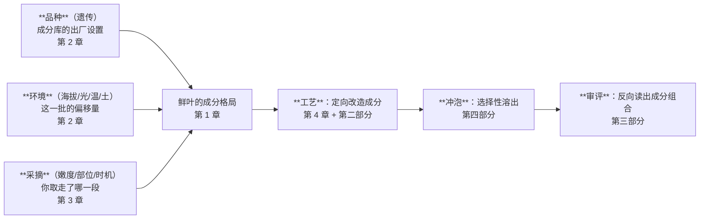

# 第一部分小结（速查）

> 把第 1~4 章压成一页。**这是查阅页，不是教学页**——概念请回原章看，
> 这里只放你以后会反复回来查的表。
>
> 章节入口：[第 1 章 成分与滋味](01-leaf-chemistry.md) ·
> [第 2 章 品种与产地](02-cultivar-terroir.md) ·
> [第 3 章 鲜叶与采摘](03-plucking.md) ·
> [第 4 章 酶与氧化](04-enzymes-oxidation.md)

## 0. 一句话与一张图

> **茶的一切技术问题，本质都是一件事——让哪些成分、以多少比例、进入茶汤。**



**三条乘法关系**（不是加法）：品种 × 环境 × 采摘。任何一层接近零，结果就接近零。

## 1. 成分 → 感受（第 1 章）

| 成分 | 鲜叶典型区间 | 对应感受 | 备注 |
|------|------------:|----------|------|
| **茶多酚**（儿茶素占 60%~80%） | 18%~36%（⚠️ 鲜叶，非成品） | **苦、涩**、汤色 | 成品：绿茶约 15%~25%，红茶因氧化远低于此 |
| ├ **酯型**儿茶素 EGCG/ECG | — | **强苦强涩**、收敛重 | EGCG 是含量最高的单体 |
| └ **非酯型** EGC/EC/C | — | 苦涩弱、偏爽口 | |
| **氨基酸**（茶氨酸占 50%+） | 1%~4%（茶氨酸 1%~2%） | **鲜、甜**，并**掩盖苦涩** | 嫩梗 > 芽 > 叶；茶氨酸嫩梗比芽叶高 **1~3 倍** |
| **咖啡碱** | 2%~4% | **苦**；但**竞争唾液蛋白结合位点 → 减弱涩** | 与 TF/TR 络合 → 冷后浑 |
| 可溶性糖 / 果胶多糖 | 可溶糖 3%~4% | **甜、稠、滑** | 糖类总量 20%~25%，多为不溶 |
| 芳香物质 | **0.005%~0.03%** | **全部香气** | 已鉴定数百种 |
| 蛋白质 / 纤维素 | 20%~30% / — | 几乎不进茶汤 | 占比最大却喝不到 |

**苦 vs 涩（必须分开记）**

| | 苦 | 涩 |
|---|---|---|
| 类型 | **味觉** | **触觉/机械感**（非味觉，味觉神经阻断实验证实） |
| 机制 | 咖啡碱、酯型儿茶素刺激苦味受体 | 多酚结合唾液蛋白 → 润滑下降（⚠️ 机制不完整，见 §5） |
| 时间 | **即时** | **约 15 s 才充分显现，余韵约 5 min** |
| 会不会累积 | 会疲劳适应 | **会累积** |
| 常指向 | 品种/咖啡碱/投茶过量/浸泡过度 | 多酚未充分转化（做青不足、发酵不足、鲜叶粗老） |

**红茶三色素**

| | 含量 | 颜色与滋味 |
|---|---|---|
| 茶黄素 TF | 0.3%~1.5% | 橙黄、**亮**、鲜爽刺激（"浓强"来源） |
| 茶红素 TR | ⚠️ 5%~15%（报道差异极大，**不引具体值**） | 红、甜醇、汤色主体 |
| 茶褐素 TB | 4%~9% | 暗褐、**滞钝**（多则"红暗"） |

## 2. 酚氨比：方向表（第 1、2 章）

```
酚氨比 = 茶多酚含量 ÷ 氨基酸含量
```

| 条件 | 酚氨比 | 结果 | 适制 |
|------|:------:|------|------|
| 春茶（低温、氮代谢旺） | **低** | 鲜爽、苦涩轻 | 名优**绿茶** |
| 夏茶（高温、碳代谢旺） | **高** | 苦涩重 | **红茶** |
| 遮阴栽培 | **最低**（实测可降至 4~5） | 极鲜、涩低 | 玉露、抹茶 |
| 大叶种 | 高 | 浓强 | 滇红、普洱 |
| 小叶种 | 低 | 鲜爽细腻 | 绿茶 |
| 高海拔（>约 500 m 起多酚随海拔降） | 偏低 | 鲜爽、香好 | 高山名优茶 |
| **叶位下移**（芽→三叶→梗以下） | **升高** | 渐粗淡 | 见 §6 采摘 |

**经验阈值**（⚠️ 非国标）：< 8 适制绿茶 · 8~15 兼制 · > 15 适制红茶。
绿茶内部细分：6~8 名优 · 8~13 高档 · 13~16 一般。

**用它必附三个条件**：① 说明取样季节与嫩度（同品种季节间可差数倍）；
② 不是唯一判据（还看儿茶素品质指数、水浸出物、咖啡碱）；③ 最终要感官审评验证。

## 3. 溶出难易 → 冲泡第一原理（第 1 章）

| 成分 | 溶出速度 | 温度敏感性 |
|------|----------|-----------|
| 氨基酸 | 快 | 低温也能溶出 |
| 咖啡碱 | 快 | **溶解度随温度显著升高** |
| 非酯型儿茶素 | 较快 | 中 |
| **酯型儿茶素** | 慢 | **高温长时显著增多** |
| 可溶性糖 | 较慢 | 中 |
| 果胶/多糖 | 慢 | 需高温长时（→ 稠、厚） |
| 芳香物质 | 挥发 | 高温快速释放**也快速逸失** |

> **低温 + 短时 → 鲜甜为主。高温 + 长时 → 苦涩与厚重。**

| 参数（杯泡/审评尺度） | 结果 | 茶汤酚氨比 |
|----------------------|------|:----------:|
| **70~80 ℃ + 20~30 s** | 利于茶氨酸溶出 | **小** → 鲜爽 |
| **90~100 ℃ + 40~50 s** | 利于茶多酚溶出 | **大** → 浓烈 |

**核心洞察**：鲜叶的酚氨比由品种季节决定，**茶汤的酚氨比由你的水温和时间决定**。
⚠️ 但溶出动力学**高度依赖物理形态**——揉捻程度、颗粒粗细、是否紧压，影响可能比温度还大。

## 4. 六大茶类 = 对酶的四种处理（第 4 章）

**酶的关键温度节点（叶温）**

| 叶温 | 酶的状态 |
|------|----------|
| **20~45 ℃** | 最适活动区，每升 10 ℃ 活性**翻倍** |
| **70 ℃** | 开始钝化变性 |
| **80~85 ℃** | 基本灭活 |

→ 杀青必须**最短时间**冲过 20~45 ℃ 区间；失重 30%~40%；下机**马上摊凉**。
→ **晒青 <80 ℃ 保留部分酶活**（普洱可陈化）vs **烘炒青 >90 ℃ 彻底破坏**（陈化走不动）。

**总表**

| 茶类 | 主导机制 | 酶的处理 | 关键工序 | 结果 |
|------|----------|----------|----------|------|
| 绿茶 | —（冻结） | **立即灭活** | 杀青 | 保留鲜叶格局，鲜爽 |
| 白茶 | 酶促（缓慢）+ 湿热 | 不主动灭活，靠失水衰减 | 萎凋 35~50 h | 轻度氧化，清甜毫香 |
| 黄茶 | **湿热为主**（±残余酶） | 先灭活，留少量 | 杀青 + 闷黄 | 黄变、转味、甜醇 |
| 乌龙茶 | 酶促（**局部、部分**） | 先放后收 | 做青 + 焙火 | 半氧化、绿叶红边 |
| 红茶 | 酶促（充分） | 全程活跃，干燥终止 | 揉捻 + 发酵 | 红汤甜醇浓强 |
| 黑茶 | **微生物** + 湿热 | 自身酶已非主角 | 渥堆 / 陈化 | 红褐陈醇 |

**氧化路径与三档程度**

```
儿茶素 → 邻醌 → 联苯酚醌 → 茶黄素 TF → 茶红素 TR → 茶褐素 TB
```

| 程度 | 停在哪 | 感官 |
|------|--------|------|
| 不足 | 未氧化儿茶素多 | 汤欠红泛青、**味青涩**、叶底花青 |
| 适度 | TF/TR 协调 | 红艳明亮、甜醇浓强 |
| 过度 | 大量 TB | **红暗浑浊、香低闷、滋味平淡**（不是更浓！） |

**红茶发酵条件**：22~30 ℃（常 26~28 ℃，先高后低）· RH **95%+** ·
工夫 2~3 h / 红碎 30~90 min · 充分供氧 · **宁轻勿重**（干燥会继续推进）。
香气进程：青草气 → 清新花香 → **果香 → 甜香**（该停）→ 香气下降 → 酸味。

**其他两条路**：白茶萎凋最适 20~30 ℃ / RH 60%~80%（36~42 ℃ 可缩至 3~6 h），
并筛节点七成/八成/九成干；黑茶渥堆堆高 1~2 m、中心温度 40~60 ℃，
**黑曲霉为优势菌约占 80%**、产约 20 种水解酶（⚠️ 但不同黑茶优势菌不同）。

## 5. 采摘速查（第 3 章）

| 标准 | 采什么 | 用于 |
|------|--------|------|
| 细嫩采 | 单芽、一芽一叶、一芽二叶初展 | 高级名茶 |
| **适中采** | 一芽二叶为主 | 大宗茶（**最普遍**） |
| **开面采** | 顶叶六七成开面时采 2~4 叶 | 乌龙茶 |
| 成熟采 | 一芽四五叶、对夹三四叶 | 边销茶（黑茶原料） |

**开面三档**：小开面（顶叶 ≈ 第二叶 1/2）· **中开面（≈2/3，春秋常用）** · 大开面（≈全部）。
**三叶中开面最适制乌龙**；采太嫩 → 色泽红褐灰暗、香低味涩；采太老 → 粗大淡薄。

**五分开**（硬要求）：品种 · 早午晚青 · 粗叶嫩叶 · 干湿茶青 · 不同地片。
不做 → 工艺参数对一部分原料必然是错的 → **叶底花杂**。

## 6. 证据强度清单（本部分最该带走的东西）

### ✅ 有共识 / 有实测支撑

- 成分与感受的对应关系（多酚→苦涩、氨基酸→鲜、咖啡碱→苦、糖与果胶→甜稠、芳香物质→香）；
- **涩是触觉/机械感而非味觉**（味觉神经阻断实验）；约 15 s 显现、余韵约 5 min；
- 酚氨比的**方向性**解释力（季节、品种、遮阴、海拔、叶位）；
- **遮阴降低酚氨比**——这是本部分证据等级最高的一条（**可重复的人工干预实验**，非相关性观察）；
- 酶的温度节点结构（低温活跃 → 70 ℃ 钝化 → 80~85 ℃ 灭活）与杀青工艺要求；
- 氧化路径 TF → TR → TB 与"过度发酵反而暗而淡"；
- 细胞破损率过高的代价（红碎茶浓强高但香甜不如工夫红茶）；
- 不同山场的土壤、地形、小气候**确有客观差异**，且会影响茶树生长与内含物积累；
- 黑茶渥堆中**微生物作用不可替代**（湿热为协同）。

### ⚠️ 有争议 / 证据不足 / 需附条件

| 说法 | 状态 |
|------|------|
| 涩的机制是"多酚沉淀唾液蛋白" | **不完整**：部分致涩物不结合唾液蛋白；EGCG 可直接激活三叉神经；Piezo2 机械受体或参与 |
| **回甘 / 生津的机理** | **无统一结论**（对比效应 / 缓慢释放 / 反射性分泌等假说）。现象照记，机理不当定论 |
| 高山茶好是因为"某段光谱" | **通俗文献自相矛盾**（蓝紫短波光 vs 红黄光），本书不采信任一；只接受"漫射光多、直射少 → 氮代谢产物积累" |
| 大叶种多酚高于小叶种 | **仅统计趋势**：变种间平均差约 6%，种质个体间差 **4 倍以上**；遗传上是连续渐变群 |
| 闷黄是否含酶促 | **学界表述不一**，本书采"以湿热为主、可能伴残余酶" |
| 茶红素的具体含量 | 报道 5%~11% / 6%~15% / 5%~27% —— **测法不同结果不同，无横向可比性** |
| 正岩 / 半岩的范围 | **边界会漂移**，不同年代文献指的不是同一块地 |
| 古树茶"树龄越老内含物越丰富" | **混杂因素无法剥离**（海拔、遮荫、稀植同时存在），留待第 31 章 |
| 晒青 <80 ℃ / 烘炒青 >90 ℃ 的具体界线 | 仅见行业资料，**未找到一手实验数据**（机理自洽） |
| 分叶位的**定量**成分表 | 公开可得的可追溯数据很少 —— 本书**只写方向、不写数字** |

### ❌ 明确错误

| 说法 | 为什么错 |
|------|----------|
| "茶多酚越高品质越好" | 多酚高只意味苦涩潜力大；品质看**比例协调** |
| "冷后浑说明变质了" | 咖啡碱与 TF/TR 络合析出，是**优质红茶的正面信号** |
| "涩就是茶不好" | 适度收敛是正常的；问题在**涩而不化** |
| "洗茶能去咖啡碱，晚上就能喝" | 无可靠定量证据，残留仍足以影响睡眠（⚠️ 但"洗茶必然洗掉鲜爽"这个**反驳**也不准确——苦涩物质损失更多，口感反而更醇和） |
| "红茶是发酵茶，含益生菌" | 红茶的"发酵"是**自身酶促氧化**，无起作用的微生物 |
| "发酵越充分茶越浓" | 过度发酵走到 TB → **暗而淡** |
| "揉捻越重越好" | 破损过强 → 其它酶活性降低 → 水解减弱 → 香甜下降 |
| "普洱生茶用什么毛茶都行" | 必须**晒青**；烘青把 PPO 彻底破坏，陈化走不动 |
| "茶越嫩越好" | 只对部分绿茶成立；乌龙采太嫩**直接是缺陷** |
| "茶里有梗是偷工减料" | **茶氨酸在嫩梗中比芽叶高 1~3 倍** |
| "等级越高越好喝" | 等级主要是**规格**（嫩度/匀整/净度/外形），不同品名的"特级"不可比 |
| "明前铁观音" | 明前/雨前是**江南茶区绿茶类**的说法；铁观音一般谷雨才开采 |
| "海拔越高茶越好" | 只在一定范围内成立；品质产量平衡点约 800 m |
| "岩韵 = 喝得出的矿物质味" | 因果链未建立；且名岩区多数微量元素含量**反而更低** |
| "杀青就是把茶叶炒干" | 杀青目的是**灭酶**，失重仅 30%~40% |

## 7. 五条可迁移的判断原则

1. **总量相同、结构不同 → 品质不同。** 遇到任何单一数字指标（水浸出物、茶多酚含量、
   茶红素含量、年份、海拔），先问：**它捕捉到结构了吗？**
2. **单项极值通常意味着失衡。** 氨基酸最高、多酚最低的材料感官分反而低。
3. **靠温度开关控制的反应，开关有延迟。** 所以杀青后马上摊凉、红茶发酵宁轻勿重。
4. **工艺参数的前提是原料均一。** 叶底花杂的 root cause 常在采摘环节，不在制茶手艺。
5. **区分"农学事实"与"市场叙事"。** 山场是真的，山场溢价是另一回事——要能分开说。

## 8. 下一站：第二部分 · 六大茶类与工艺原理

第一部分给了你**框架**；第二部分是给这个框架**填细节**。

具体地说，§4 那张"六大茶类 = 对酶的四种处理"总表，接下来会被逐行展开成一章：

| 下一部分的章 | 展开的是 §4 表里的哪一行 |
|---|---|
| 第 5 章 分类的逻辑（GB/T 30766）| 整张表的**分类依据**与工艺总图 |
| 第 6 章 绿茶：杀青 | "立即灭活"——炒青/烘青/蒸青/晒青的分野 |
| 第 7 章 白茶：萎凋 | "不主动灭活"——为什么最少干预最难控 |
| 第 8 章 黄茶：闷黄 | "湿热为主"——一步之差与绿茶分家 |
| 第 9 章 乌龙茶：做青与焙火 | "局部、部分氧化"——技术顶点 |
| 第 10 章 红茶：全发酵 | "充分氧化"——TF/TR/TB 的调控 |
| 第 11 章 黑茶与普洱 | "微生物作用"——渥堆 vs 自然陈化 |
| 第 12 章 再加工茶 | 花茶窨制、紧压、抹茶 |
| 🛠 项目 P1 | 从工艺特征**反推**茶类与工艺缺陷 |

> **一个建议**：进第二部分之前，把 §4 的总表和 §1 的成分表**默写一遍**。
> 这两张表是后面所有章节的公共前提——记住了，第二部分基本是"对号入座"；
> 没记住，就会变成背名词。

**开始** → [第二部分 · 六大茶类与工艺原理](../../roadmap.md)（章节陆续更新）
