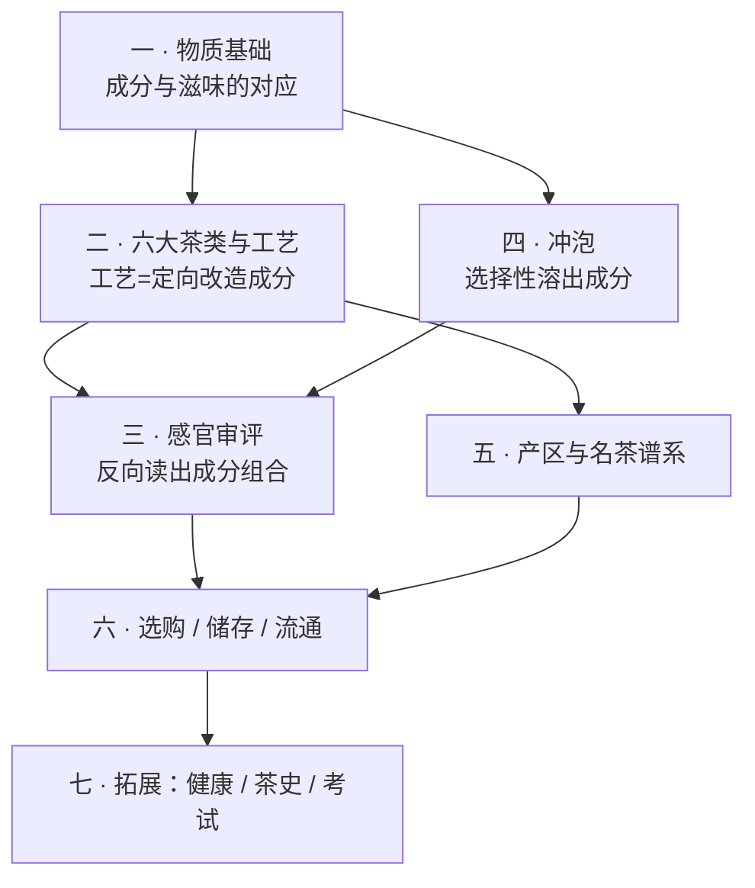

# 学习路线图 (Roadmap)

> **总目标**：系统性地把茶学吃透到**评茶员知识体系**的深度——看懂六大茶类的工艺原理、
> 会用标准方法做感官审评、能把"好喝"翻译成可复现的判断，并能独立选购、储存、冲泡。
>
> 分七部分，由浅入深、前后依赖。这是一份**活的大纲**：随学习进度和兴趣随时调整。
> 状态标记：✅ 已完成 · 🔜 进行中 · ⬜ 待学。

## 这本书的依赖顺序（为什么这么排）

一句话：**第一部分是地基**。茶的一切技术问题，本质都是「让**哪些成分**、以**多少比例**、
进入茶汤」——工艺在改造成分，冲泡在选择性溶出成分，审评在反向读出成分组合。

---

## 第一部分 · 茶的物质基础

**目标**：建立"成分 → 滋味/香气/汤色"的对应关系。这是全书的地基，后面每一部分都要回头引用。

| 章 | 主题 | 一句话学到什么 | 状态 |
|----|------|----------------|------|
| 1 | 一片叶子里有什么 | 五大类成分各对应哪种感受，酚氨比为什么能解释很多事 | ✅ |
| 2 | 茶树：品种、产地与"山场" | 品种/海拔/土壤/遮阴如何在成分层面进入茶汤 | ⬜ |
| 3 | 鲜叶与采摘 | 嫩度、采摘标准与"等级"的由来，明前贵在哪 | ⬜ |
| 4 | 酶与氧化 | 所谓"发酵"到底发生了什么，酶促 vs 非酶促 vs 微生物 | ⬜ |
| — | 第一部分小结（速查） | 一页表带走全部对应关系 | ⬜ |

> **学完能**：拿到任何一款茶的描述，能大致推断它的成分格局和滋味走向。

---

## 第二部分 · 六大茶类与工艺原理 ★核心

**目标**：理解分类的**逻辑**（不是背名字），能从工艺步骤推出成品特征，反之亦然。

| 章 | 主题 | 一句话学到什么 | 状态 |
|----|------|----------------|------|
| 5 | 分类的逻辑 | GB/T 30766 的分类依据 + 一张工艺总图看懂六类差别 | ⬜ |
| 6 | 绿茶：杀青 | 如何用高温"锁住"绿，炒青/烘青/蒸青/晒青的分野 | ⬜ |
| 7 | 白茶：萎凋 | 最少干预为什么最难控，新白茶与老白茶 | ⬜ |
| 8 | 黄茶：闷黄 | 一步之差与绿茶分家，为什么产量最小 | ⬜ |
| 9 | 乌龙茶：做青与焙火 | 半发酵的技术顶点，摇青/晾青/焙火如何塑造香与韵 | ⬜ |
| 10 | 红茶：全发酵 | 茶黄素/茶红素/茶褐素的生成与汤色滋味 | ⬜ |
| 11 | 黑茶与普洱 | 微生物后发酵：渥堆（熟）vs 自然陈化（生） | ⬜ |
| 12 | 再加工茶 | 花茶窨制、紧压、抹茶、速溶与调饮基底 | ⬜ |
| — | 第二部分小结（速查） | 六类工艺一张对照表 | ⬜ |
| 🛠 | **项目 P1：从工艺特征反推茶类** | 给若干条描述，判断类别与工艺缺陷 | ⬜ |

> **学完能**：看到一款陌生茶的干茶、汤色、叶底，说出它属于哪一类、大致经历了什么工艺。

---

## 第三部分 · 感官审评：把"好喝"变成可复现的判断 ★核心

**目标**：掌握标准审评方法与术语体系，让判断可复现、可交流、可与人对样。

| 章 | 主题 | 一句话学到什么 | 状态 |
|----|------|----------------|------|
| 13 | 审评体系概览 | 审评室/器具/GB/T 23776 的标准流程与为什么这么定 | ⬜ |
| 14 | 干评与湿评 | 五因子（外形/汤色/香气/滋味/叶底）怎么走一遍 | ⬜ |
| 15 | 审评术语 | 把"好喝"翻译成 GB/T 14487 的规范词 | ⬜ |
| 16 | 香气 | 品种香/工艺香/地域香/劣变气的来源与判别 | ⬜ |
| 17 | 滋味 | 浓淡、强弱、鲜爽、涩感、回甘、生津的机理 | ⬜ |
| 18 | 叶底与汤色 | 两项最不容易骗人的证据 | ⬜ |
| 19 | 缺陷与劣变 | 烟焦、酸馊、陈霉、水闷、青气：从哪一步坏的 | ⬜ |
| 20 | 评分与对样 | 权重、计分与"对标准样"评茶 | ⬜ |
| 🛠 | **项目 P2：自建审评表 + 30 天盲品训练计划** | 从"我觉得好喝"到可复现打分 | ⬜ |

> **学完能**：按标准方法审评一款茶，写出规范的审评词并给分；和别人对样时说得清分歧在哪。

---

## 第四部分 · 冲泡：可控变量与茶汤

**目标**：把冲泡当成**控制变量实验**。四个旋钮各自改变什么，为什么。

| 章 | 主题 | 一句话学到什么 | 状态 |
|----|------|----------------|------|
| 21 | 四个旋钮 | 水温/茶水比/时间/器型分别调的是哪些成分 | ⬜ |
| 22 | 水 | 硬度、pH、矿物质如何改变汤色与滋味 | ⬜ |
| 23 | 器 | 盖碗/紫砂/玻璃/飘逸杯/煮饮的适用边界 | ⬜ |
| 24 | 一茶多泡 | 冲泡曲线与出汤节奏，"耐泡"到底是什么 | ⬜ |
| 25 | 醒茶、洗茶、冷泡 | 常见说法的证据核查 | ⬜ |
| 🛠 | **项目 P3：控制变量冲泡矩阵** | 同一款茶跑一个 3×3 实验，画出自己的冲泡曲线 | ⬜ |

> **学完能**：拿到一款陌生茶，几泡内找到它的合适参数；能解释"为什么这泡苦了"。

---

## 第五部分 · 产区与名茶谱系

**目标**：建立地理与谱系的地图，把名字挂到工艺和风味上，而不是死记硬背。

| 章 | 主题 | 一句话学到什么 | 状态 |
|----|------|----------------|------|
| 26 | 中国四大茶区 | 地理气候如何决定茶类分布 | ⬜ |
| 27 | 绿茶名品谱系 | 龙井/碧螺春/毛峰/安吉白茶…差异在哪 | ⬜ |
| 28 | 乌龙谱系 | 闽南/闽北/广东/台湾四条支线 | ⬜ |
| 29 | 红茶谱系 | 正山小种/祁门/滇红 + 阿萨姆/大吉岭/锡兰/肯尼亚 | ⬜ |
| 30 | 白茶与黄茶谱系 | 品种、等级（银针/牡丹/寿眉）与产区 | ⬜ |
| 31 | 黑茶与普洱 | 产区、山头、年份与"越陈越香"的边界 | ⬜ |
| 32 | 世界茶 | 日本蒸青体系、印度、斯里兰卡、非洲 | ⬜ |
| 🛠 | **项目 P4：产区盲品地图** | 从风味特征反推产区与品种 | ⬜ |

---

## 第六部分 · 选购、储存与流通

**目标**：把知识变成花钱不吃亏的能力。

| 章 | 主题 | 一句话学到什么 | 状态 |
|----|------|----------------|------|
| 33 | 选购 | 看什么、问什么，常见坑（做旧/年份/山头/拼配误解） | ⬜ |
| 34 | 价格是怎么形成的 | 成本结构、稀缺性叙事与溢价来源 | ⬜ |
| 35 | 储存 | 六大茶类各自的存法与变质机理（受潮/氧化/串味/陈霉） | ⬜ |
| 36 | 包装与标准 | 读懂执行标准号、等级、地理标志与保质期 | ⬜ |
| 🛠 | **项目 P5：一次真实选购决策复盘** | 把全书知识跑一遍真实购买 | ⬜ |

---

## 第七部分 · 拓展

| 章 | 主题 | 一句话学到什么 | 状态 |
|----|------|----------------|------|
| 37 | 茶与健康 | 证据等级怎么读，常见说法逐条辨析（不做医疗建议） | ⬜ |
| 38 | 茶史与茶文化速览 | 唐煮宋点明清泡、《茶经》、茶马古道、日本茶道、英式下午茶 | ⬜ |
| 39 | 评茶员 / 茶艺师考试导览 | 等级、考什么、怎么准备 | ⬜ |
| 40 | 国标索引与中英术语对照 | 一页查到所有标准与术语 | ⬜ |

---

## 调整记录

- **2026-08-03**：立项。确定七部分 40 章 + 5 个项目；深度对标评茶员体系；
  实操统一写成「🅐 无器具版 / 🅑 有条件版」两档（读者暂无茶具茶样）。
